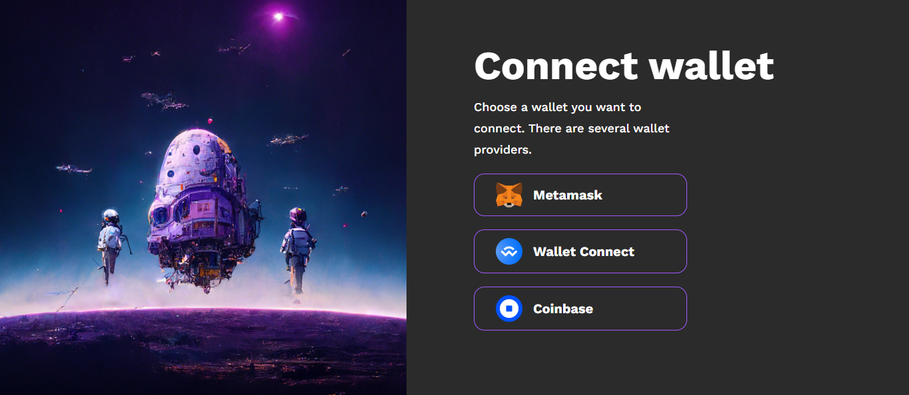
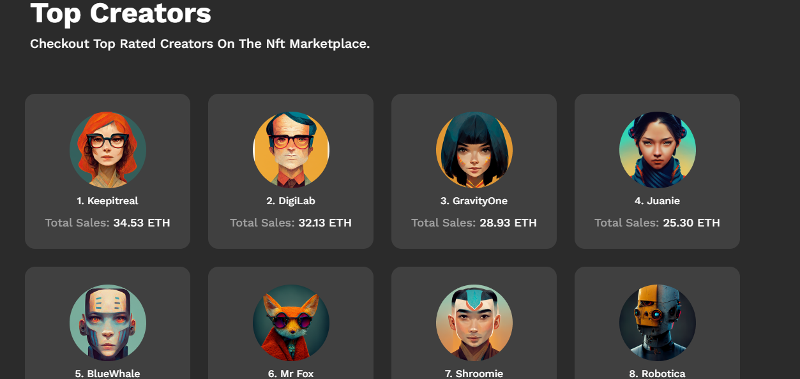
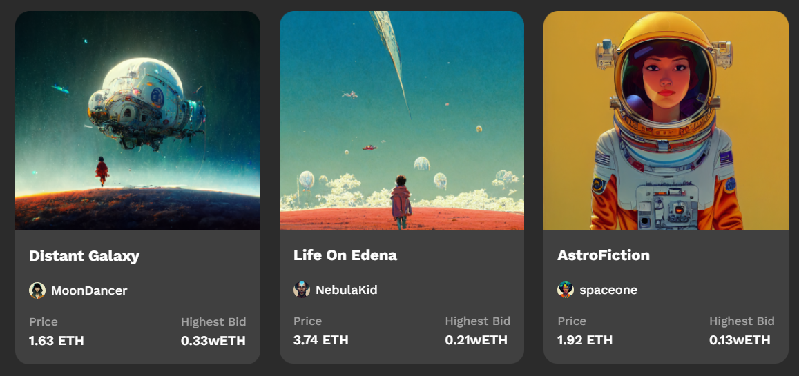

# React + Vite

This template provides a minimal setup to get React working in Vite with HMR and some ESLint rules.

Currently, two official plugins are available:

- [@vitejs/plugin-react](https://github.com/vitejs/vite-plugin-react/blob/main/packages/plugin-react/README.md) uses [Babel](https://babeljs.io/) for Fast Refresh
- [@vitejs/plugin-react-swc](https://github.com/vitejs/vite-plugin-react-swc) uses [SWC](https://swc.rs/) for Fast Refresh

# NFT Marketplace

A multipage NFT Marketplace website built using React, Tailwind CSS, React Icons, and React Router with nested layouts. The platform allows users to browse NFT rankings, explore the marketplace, and connect their wallet. It also includes a 404 Not Found page for invalid routes.

## Features

- Ranking Page: Displays top NFTs and rankings.
- Marketplace Page: Allows users to explore and discover NFTs.
- Connect Wallet Page: Users can connect their crypto wallet.
- 404 Not Found Page: Redirects users if the route does not exist.
- React Router Nested Layout: Handles page navigation efficiently.
- Responsive Design: Built with Tailwind CSS for a seamless experience on mobile and desktop.

## Tech Stack

- React: A JavaScript library for building user interfaces.
- Tailwind CSS: A utility-first CSS framework for styling.
- React Router: For handling page navigation and routes.
- React Icons: A popular icon library to enhance UI/UX.

